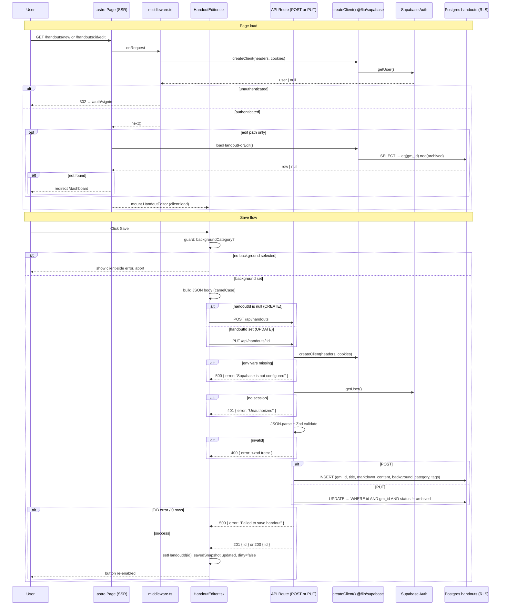

# Research: Handout Save Flow — End-to-End Analysis

**Date**: 2026-06-24T13:51:00+02:00  
**Researcher**: Cogitator  
**Git Commit**: `62ba8366b82da40bc998c84448edbe678d50ef8e`  
**Branch**: `feature/lesson-16`  
**Repository**: ttrpg-handouts-generator

---

## Research Question

Analyze the handout save flow (process zapisu postów), paying special attention to the related areas defined in `context/map/repo-map.md`. Three dimensions: (1) E2E trace from entry point through layers to DB read/write, (2) test coverage gaps, (3) blast radius — what must change together when the flow changes.

---

## Summary

The handout save flow is a **dual-path, client-driven** pipeline: `HandoutEditor.tsx` issues either a `POST /api/handouts` (create) or a `PUT /api/handouts/[id]` (update) depending on whether a `handoutId` is set in component state. Both paths share the same Zod schema, the same response handling, and the same DB ownership guard, but live in two independent API files with duplicated code.

**Integration-test coverage at the API layer is solid** for happy paths, auth, validation, and ownership/archived guardrails. The entire **HandoutEditor save UX is untested** (no test exercises the Save button click). Infrastructure failure paths (`createClient null`, real DB errors) are also uncovered.

The **most dangerous technical debt** is the duplicated Zod schema + manual `camelCase ↔ snake_case` mapping spread across four independent files with no shared source of truth and no generated Supabase types to catch drift at compile time.

---

## Feature Overview

### Two entry pages, one component

| Page | Route | Handout state |
|------|-------|---------------|
| `src/pages/handouts/new.astro` | `/handouts/new` | No initial handout; `handoutId` starts `null` |
| `src/pages/handouts/[id]/edit.astro` | `/handouts/:id/edit` | SSR-loaded via `loadHandoutForEdit`; `handoutId` pre-populated |

Both pages mount `<HandoutEditor client:load />` (React island). The edit page additionally calls `loadHandoutForEdit` on the server to prefill the editor with the existing draft or published handout.

### Save trigger (UI)

```
User clicks "Save handout" / "Save changes"
  └─ HandoutEditor.tsx:handleSave() [line 89]
       ├─ Guard: if (!backgroundCategory) → show client error, abort [line 90]
       └─ Build JSON body { title, markdownContent, backgroundCategory, tags } [line 99]
            ├─ const url = handoutId ? `/api/handouts/${handoutId}` : '/api/handouts' [line 100]
            └─ const method = handoutId ? 'PUT' : 'POST' [line 101]
```

On success (201 or 200): `handoutId` is set/kept from the response `{ id }`, `savedSnapshot` is updated, dirty state clears.  
On failure: `saveError` string is shown; `isSaving` is cleared.

### API routes

Both routes share the same structure:

1. `createClient()` — returns `null` if env vars missing → 500
2. `supabase.auth.getUser()` — no user → 401
3. Parse JSON body → 400 on bad JSON
4. Zod validate with `handoutInputSchema` → 400 on failure
5. Supabase `insert` / `update` → 500 on DB error; 201/200 on success

`POST /api/handouts` (`src/pages/api/handouts/index.ts`) inserts with `gm_id: user.id`.  
`PUT /api/handouts/[id]` (`src/pages/api/handouts/[id].ts`) validates UUID, updates filtering `.eq('id').eq('gm_id').neq('status','archived')`. A 0-rows update (wrong owner, archived, unknown id) returns **500** — not 404.

---

## Detailed Findings

### 1. End-to-End Trace

```
Step  File:line                                      Action
────  ─────────────────────────────────────────────  ───────────────────────────────────
 1    src/middleware.ts                               onRequest — resolves user via createClient + getUser; redirects unauthenticated to /auth/signin
 2    src/pages/handouts/new.astro                   SSR renders HandoutEditor with no initialHandout
      src/pages/handouts/[id]/edit.astro             (or) SSR calls loadHandoutForEdit; redirect /dashboard if not found
 3    src/lib/load-handout-for-edit.ts               SELECT id,title,markdown_content,background_category,tags,status,share_token WHERE id+gm_id+status!=archived
 4    HandoutEditor.tsx (client:load)                React island mounts; state initialised from InitialHandout props (or blank)
 5    HandoutEditor.tsx:handleSave                   User clicks Save; backgroundCategory guard runs
 6    HandoutEditor.tsx:handleSave                   fetch() called — POST or PUT depending on handoutId state
 7    src/pages/api/handouts/index.ts OR [id].ts     API: createClient → getUser → JSON parse → Zod validate
 8    src/pages/api/handouts/index.ts:52-63          DB INSERT { gm_id, title, markdown_content, background_category, tags }
      src/pages/api/handouts/[id].ts:63-84           (or) DB UPDATE ... WHERE id + gm_id + status != archived
 9    HandoutEditor.tsx:handleSave                   Response: setHandoutId(id); update savedSnapshot; clear dirty
```

#### Mermaid sequence diagram



### 2. HTTP Status Codes

#### POST `/api/handouts`

| Status | Body | Condition |
|--------|------|-----------|
| 201 | `{ id: string }` | Insert succeeded |
| 400 | `{ error: "Invalid JSON body" }` | Non-JSON payload |
| 400 | `{ error: <zod tree> }` | Schema validation failure |
| 401 | `{ error: "Unauthorized" }` | No session |
| 500 | `{ error: "Supabase is not configured" }` | Missing env vars |
| 500 | `{ error: "Failed to save handout" }` | DB insert error |

#### PUT `/api/handouts/[id]`

| Status | Body | Condition |
|--------|------|-----------|
| 200 | `{ id: string }` | Update succeeded |
| 400 | `{ error: "Missing handout id" }` | Empty path param |
| 400 | `{ error: "Invalid handout id" }` | Non-UUID path param |
| 400 | `{ error: "Invalid JSON body" }` | Non-JSON payload |
| 400 | `{ error: <zod tree> }` | Schema validation failure |
| 401 | `{ error: "Unauthorized" }` | No session |
| 500 | `{ error: "Supabase is not configured" }` | Missing env vars |
| 500 | `{ error: "Failed to save handout" }` | DB error, 0 rows (wrong owner, archived, unknown id) |

**Note:** There is no 404 on PUT save — wrong owner and non-existent id both collapse to 500 with a generic message.

---

## Technical Debt

### TD-1 — Duplicated Zod schema (highest risk)

`handoutInputSchema` is copy-pasted identically in `src/pages/api/handouts/index.ts:8-13` and `src/pages/api/handouts/[id].ts:8-13`. A field addition must be made in both files; TypeScript will not catch a missed copy.

**Impact:** Any new persisted field touches: both API files, `src/types.ts`, `src/components/organisms/HandoutEditor.tsx`, `src/lib/load-handout-for-edit.ts`, and the migration. Four independent manual mappings must stay in sync with no compile-time enforcement.

### TD-2 — No generated Supabase types

`src/lib/supabase.ts` exports a plain `createServerClient` with no `Database` generic. All `.from('handouts')` calls are stringly-typed. A column rename in a migration will not cause a TypeScript error anywhere.

**ast-grep confirmed 7 call sites** (broader than the save path alone):

| File | Line | Operation |
|------|------|-----------|
| `src/pages/api/handouts/index.ts` | 53 | INSERT |
| `src/pages/api/handouts/[id].ts` | 63 | UPDATE |
| `src/pages/api/handouts/[id].ts` | 113 | DELETE |
| `src/pages/api/handouts/[id]/archive.ts` | 37 | UPDATE (archive) |
| `src/pages/api/handouts/[id]/publish.ts` | 48 | SELECT |
| `src/pages/api/handouts/[id]/publish.ts` | 83 | UPDATE (publish) |
| `src/lib/load-handout-for-edit.ts` | 39 | SELECT |

### TD-3 — `SaveApiResponse.error` typed as `string` but receives a zod tree on 400

`HandoutEditor.tsx` types the API error as `string`. On a 400 response, the body contains `{ error: z.treeifyError(...) }` — an object. The UI will display `[object Object]` to the user for Zod validation failures.

**ast-grep confirmed** at `HandoutEditor.tsx:22`:
```typescript
type SaveApiResponse = { id: string } | { error: string };
```
The union type declares `error: string`, but the API's 400 path returns a zod error tree (object). Line 113 passes `responseData.error` directly to `setSaveError` with no stringify.

### TD-4 — PUT miss returns 500 instead of 404

When a PUT request targets an unknown id (valid UUID, not owned by user, or archived), the API returns `500 "Failed to save handout"`. This is indistinguishable from a real server error, making debugging harder and potentially misleading monitoring dashboards.

### TD-5 — HandoutEditor save UX has zero test coverage

No test file exercises the Save button click or calls `handleSave`. Neither create mode (POST) nor update mode (PUT) is exercised from the UI layer. `HandoutEditor.test.tsx` stubs `fetch` to `ok: false` globally but never triggers a save.

### TD-6 — UI validation gaps relative to API

- `TagsInput` does not enforce `max 20 tags` or `max 50 chars/tag` — the API rejects these but the UI allows them to be submitted.
- Title has HTML `maxLength={300}` but no minimum (empty title is accepted on save; publish enforces non-empty separately).

### TD-7 — `Handout` vs `InitialHandout` type split

The full `Handout` entity (snake_case) is defined in `src/types.ts` but is not used by the save path. The editor operates on a parallel `InitialHandout` (camelCase DTO). New fields added to `Handout` do not automatically surface in the editor without an explicit `InitialHandout` update.

---

## Code References

- `src/components/organisms/HandoutEditor.tsx:89-128` — `handleSave` function (save trigger, dual-path fetch)
- `src/pages/api/handouts/index.ts:8-13` — `handoutInputSchema` (Zod, copy 1)
- `src/pages/api/handouts/index.ts:52-63` — DB INSERT with column mapping
- `src/pages/api/handouts/[id].ts:8-13` — `handoutInputSchema` (Zod, copy 2)
- `src/pages/api/handouts/[id].ts:63-84` — DB UPDATE with ownership filter + 0-rows → 500
- `src/lib/load-handout-for-edit.ts:38-44` — SSR SELECT + `mapHandoutEditRow`
- `src/types.ts` — `Handout`, `InitialHandout`, `BackgroundCategory`, `HandoutStatus`
- `src/middleware.ts` — auth gate (pages only, not `/api/*`)
- `supabase/migrations/20260528200000_create_handouts_table.sql` — table schema + RLS policies
- `__tests__/components/organisms/HandoutEditor.test.tsx` — navigation/edit-mode tests (no save)
- `__tests__/integration/handouts/handout-validation.integration.test.ts` — POST/PUT 400 validation
- `__tests__/integration/handouts/edit-handout.integration.test.ts` — PUT happy paths, archived 500, ownership 500
- `__tests__/integration/handouts/handout-ownership.integration.test.ts` — 401, cross-owner 500
- `__tests__/integration/migration/rls-policy-matrix.integration.test.ts` — cookie SSR path + real RLS

---

## Architecture Insights

- **Middleware does not gate `/api/*`** — API routes handle auth independently via `createClient` + `getUser`. This is intentional but means every API route must replicate the auth check.
- **RLS as defence-in-depth** — both `gm_update_non_archived` RLS policy and the API `.eq('gm_id')` filter assert ownership independently (in line with the team lesson on double-layer ownership guards).
- **No PATCH** — updates use `PUT` (full replacement of mutable fields). There is no partial update route.
- **Publish is a separate flow** — `POST /api/handouts/[id]/publish` — not part of save. Empty title/content is enforced only at publish, not at save.
- **Integration tests intentionally bypass the SSR cookie path** — most integration tests inject a bearer-auth Supabase client directly, not the `@/lib/supabase` SSR client. Only `rls-policy-matrix.integration.test.ts` exercises the real cookie path.

---

## Historical Context

- `context/archive/2026-05-30-first-handout-creation-and-sharing/` — original save/publish pipeline (commits `66aab0a`, `d09b4c4`, `5474f48`)
- `context/archive/2026-06-03-testing-api-db-handout-coverage/` — API contract test introduction
- `context/changes/s-03/` — active at scan time: edit flow (relax PUT filter, `InitialHandout`, SSR edit page — commits `07d196a`, `ec40c2e`)

Key co-change commits in save flow evolution:

| Commit | Message |
|--------|---------|
| `66aab0a` | feat: Editor Island and Draft API (p2) |
| `d09b4c4` | feat: enhance handout editor and API security |
| `5474f48` | fix: address full-plan impl-review findings |
| `554acb3` | feat(sentry-introduction): Error Capture Depth (p2) |
| `8a5f74f` | feat(s-03): Relax PUT API Filter (p1) |
| `07d196a` | feat(s-03): HandoutEditor initial-data props (p2) |
| `ec40c2e` | feat(s-03): Edit Page and Dashboard Navigation (p3) |

---

## Blast Radius: What Must Change Together

### Adding a new persisted field to `Handout`

| Tier | Files |
|------|-------|
| DB | New migration `supabase/migrations/YYYYMMDDHHmmss_*.sql` |
| Types | `src/types.ts` — `Handout` and `InitialHandout` |
| API (×2) | `src/pages/api/handouts/index.ts` — Zod schema + INSERT mapping |
| API (×2) | `src/pages/api/handouts/[id].ts` — Zod schema + UPDATE mapping |
| SSR loader | `src/lib/load-handout-for-edit.ts` — `.select(...)` + `mapHandoutEditRow` |
| UI | `src/components/organisms/HandoutEditor.tsx` — state, `serializeFormState`, `requestBody`, form control |
| Tests | `handout-validation`, `edit-handout`, `rls-policy-matrix`, `HandoutEditor.test.tsx` |
| E2E | `e2e/seed.spec.ts`, `e2e/player-share-link.spec.ts` |

### Changing API response shape (e.g. return full handout)

Must change: `HandoutEditor.tsx` (`SaveApiResponse` type + `handleSave` consumer), all integration/e2e tests that assert `{ id }`.

### Renaming a DB column

Must change: both API insert/update mappings, SSR loader, all integration tests inserting/selecting rows, possibly RLS if column affects policy.

---

## ast-grep Verification (2026-06-24)

Structural claims from the research were verified using **ast-grep 0.44.0** against the live codebase. Results per claim:

| # | Claim | Pattern | Result | Detail |
|---|-------|---------|--------|--------|
| 1 | `handoutInputSchema` duplicated in both API files | `const handoutInputSchema = z.object({ $$$ })` | ✓ Confirmed | `index.ts:8-13` and `[id].ts:8-13` — byte-for-byte identical |
| 2 | `handleSave` at `HandoutEditor.tsx:89-128` | `const handleSave = async () => { $$$ }` | ✓ Confirmed | Exact match lines 89–128 |
| 3 | DB INSERT at `index.ts:52-63` | `$A.insert({ $$$ })` | ✓ Confirmed | Chain at `index.ts:52-60`; `.select('id').single()` cast closes at :62 |
| 4 | DB UPDATE at `[id].ts:63-84` | `$A.update({ $$$ })` | ✓ Confirmed | `.from()` at :63, `.update()` at :64-69; filter chain ends ~:73 |
| 5 | `SaveApiResponse.error` typed as `string` | `type SaveApiResponse = $$$` | ✓ Confirmed | `HandoutEditor.tsx:22`: `{ id: string } \| { error: string }` |
| 6 | `backgroundCategory` falsy guard before fetch | (confirmed via handleSave match) | ✓ Confirmed | `if (!backgroundCategory)` at line 90 |
| 7 | `handoutId === null` → POST, set → PUT | `handoutId === null` | ⚠ Refined | Actual code uses **ternary truthiness** `handoutId ? 'PUT' : 'POST'` at lines 100–101, not strict null equality |
| 8 | All `.from('handouts')` calls stringly-typed | `rg .from\('handouts'\)` | ⚠ Expanded | **7 call sites** found (not just save-path 3); all stringly-typed — see TD-2 table above |
| 9 | `mapHandoutEditRow` — single call site | `mapHandoutEditRow($$$)` | ✓ Confirmed | One call: `load-handout-for-edit.ts:55` |
| 10 | `TagsInput` has no tag-count/length limit | `$_.length > 20` / `>= 20` | ✓ Confirmed | Only `tags.length === 0` for placeholder text; no enforcement |
| 11 | `handoutInputSchema.safeParse` in both routes | `rg handoutInputSchema\.safeParse` | ✓ Confirmed | `index.ts:43` and `[id].ts:53` |
| B | `.eq('gm_id', user.id)` on all mutations | `rg .eq\('gm_id'` | ✓ Confirmed | Present in UPDATE (`[id].ts:71`), archive, and publish — consistent ownership enforcement |

**Corrections applied to this document:**
- §Save trigger: changed `handoutId === null` to truthiness ternary (`handoutId ? 'PUT' : 'POST'`)
- §TD-2: expanded `.from('handouts')` to 7 call sites with a full table
- §TD-3: added the confirmed `SaveApiResponse` type literal

---

## Open Questions

1. **Why no PATCH?** Using PUT for partial updates means the client always sends all mutable fields; a follow-up could introduce PATCH with field-level validation.
2. **Should `status` be returned on save?** Currently the editor re-derives dirty state from a snapshot; returning the persisted row would reduce state management complexity.
3. **Is the 500 on PUT miss acceptable?** Using 500 for "row not found or not owned" makes it indistinguishable from real server errors in logs and dashboards — consider 404.
4. **Zod schema deduplication** — extract `handoutInputSchema` to `src/lib/handout-schema.ts` (shared import) before the next field is added.
5. **Supabase generated types** — `supabase gen types typescript` would give compile-time safety for all `.from('handouts')` calls.
