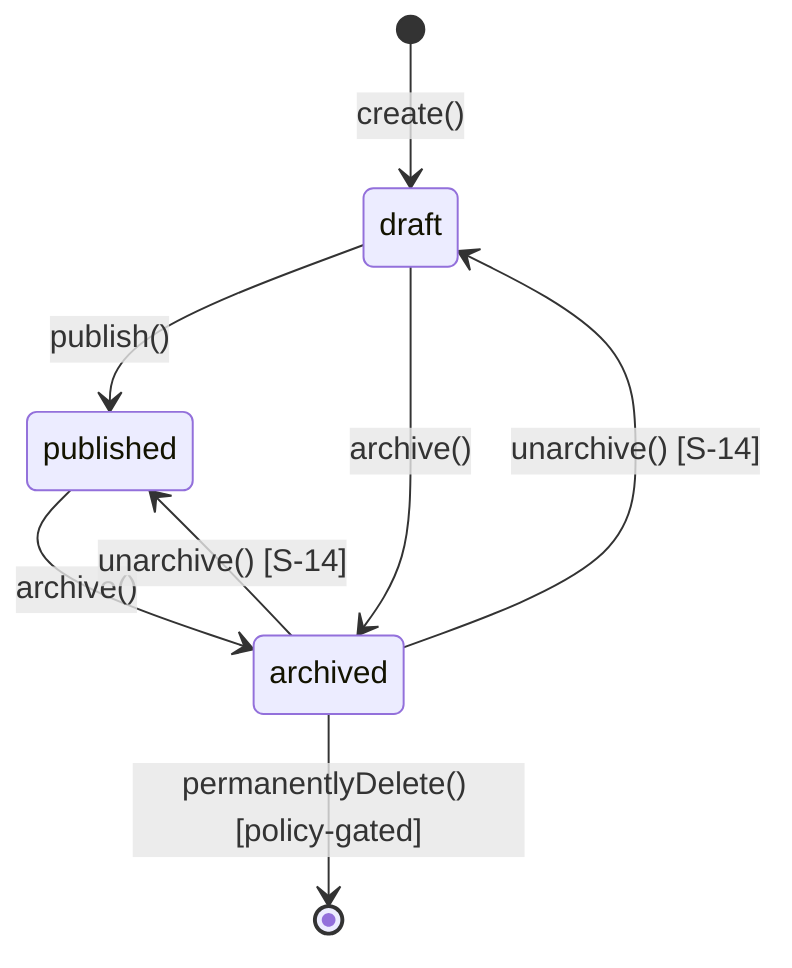

# Invariant Aggregate Refactor Plan — Handout Lifecycle

> **Scope:** Refactor plan only. No production code changes in this artifact.
> **Prior art:** `context/domain/01-domain-distillation.md`

---

## Step 0 — Project Context

### Requirements sources

| Document | Relevant sections |
| -------- | ----------------- |
| `context/foundation/prd.md:133-143` | Business Logic — draft → published → archived state machine |
| `context/foundation/prd.md:130-131` | NFR — link permanence (365 days, survives archive) |
| `context/foundation/prd.md:55,147-149` | Privacy / GM ownership |
| `context/foundation/roadmap.md:291-301` | S-14 unarchive (planned extension) |
| `context/domain/01-domain-distillation.md` | Ubiquitous language, divergence table, refactor ranking |

### Stack and business-logic layers

| Layer | Path | Role today |
| ----- | ---- | ---------- |
| Persistence + RLS | `supabase/migrations/20260528200000_create_handouts_table.sql` | Enum constraints, ownership, archive write block, anon read policy |
| API commands | `src/pages/api/handouts/` | Create, update, publish, archive, hard-delete |
| Read models | `src/pages/dashboard.astro`, `src/pages/share/[token].astro`, `src/lib/load-handout-for-edit.ts` | GM list, player view, edit preload |
| UI guards | `src/components/organisms/HandoutEditor.tsx`, `HandoutCard.astro` | Disable Share when dirty; hide Edit on archived |
| Shared types | `src/types.ts` | DTO shapes; no behaviour |
| Tests | `__tests__/integration/handouts/`, `__tests__/integration/share/` | HTTP + RLS contract tests via Vitest |

There is **no domain module**. State rules are duplicated across SQL, four API handlers, two page loaders, and React/Astro UI conditionals.

---

## Step 1 — Business Invariants Identified

Rules extracted from PRD, roadmap, and verified code. Each must hold for the product to match its stated purpose.

| ID | Invariant | Source |
| -- | --------- | ------ |
| **INV-1** | A handout is owned by exactly one GM; `gm_id` never changes after creation | `prd.md:154`; RLS — `...sql:42,46` |
| **INV-2** | New handouts start as `draft` with `share_token = null` | `prd.md:139`; DB default — `...sql:16-17` |
| **INV-3** | Only `draft` handouts may receive their **first** publish (assign `share_token`, set `published_at`) | `prd.md:139-141`; `publish.ts:52,91` |
| **INV-4** | Publish requires non-empty title, markdown content, and background category | Implied by US-01 — `prd.md:62-64`; `publish.ts:65-77` |
| **INV-5** | `draft` and `published` handouts are editable by the owning GM; `archived` handouts are not | `prd.md:141,143`; `[id].ts:72`; `...sql:45` |
| **INV-6** | GM "delete" is soft-delete: transition to `archived`, not row removal | `prd.md:143`, FR-008; `archive.ts:38-40` |
| **INV-7** | Player share links resolve for `published` **and** `archived` rows with a non-null `share_token` | NFR — `prd.md:130-131`; `share/[token].astro:32`; RLS — `...sql:52-54` |
| **INV-8** | `draft` rows are never readable via share token (privacy until explicit share) | `prd.md:55`; RLS excludes draft — `...sql:54` |
| **INV-9** | Legal state transitions are finite: `draft→published`, `{draft,published}→archived`; no other transitions unless explicitly added (S-14) | `prd.md:135`; implied by enum — `...sql:5` |
| **INV-10** | Published handout edits propagate immediately to the live shared view (same row, no staging) | `prd.md:141`; `[id].ts:62-69` + `share/[token].astro:28-33` |
| **INV-11** | Handouts auto-archive 365 days after publication | `prd.md:135,143` |
| **INV-12** | Hard delete of a handout with an active share link breaks link permanence — must be policy-controlled | Divergence — `01-domain-distillation.md:127-128`; `[id].ts:112-119` |

---

## Step 2 — Classification and #1 Selection

Scoring: **Core** (1–3, product hypothesis), **Spread** (files/layers), **Enforcement** (enforced / declared / violable).

| ID | Core | Spread | Enforcement | Notes |
| -- | ---- | ------ | ----------- | ----- |
| INV-1 | 2 | 3 layers (RLS, API `.eq('gm_id')`, middleware auth) | Enforced | Stable |
| INV-2 | 3 | 2 (DB default, create API) | Enforced | Stable |
| INV-3 | 3 | 3 (publish API, editor UI, RLS implicit) | Enforced | Only in publish route |
| INV-4 | 2 | 2 (publish API, editor save guard) | Enforced | Publish-only |
| INV-5 | 3 | **5** (PUT API, RLS, load-handout, HandoutCard, editor) | Enforced but **inconsistent errors** | PUT miss → 500 — `[id].ts:76-83` |
| INV-6 | 3 | 3 (archive API, ArchiveButton, dashboard partition) | Enforced | Clear |
| INV-7 | **3** | **4** (RLS, share page, share-token tests, DeleteHandoutButton contradicts) | **Partially enforced / violable** | Hard DELETE breaks — `[id].ts:112-119` |
| INV-8 | 3 | 2 (RLS, share page) | Enforced | Stable |
| INV-9 | **3** | **6+** (4 API files, RLS, UI, no single transition table) | **Declared, not centralized** | No transition matrix in code |
| INV-10 | 3 | 2 | Declared | Works by accident (shared row) |
| INV-11 | 2 | 0 | **Not enforced** | No scheduler |
| INV-12 | 3 | 2 | **Violable** | DeleteHandoutButton explicitly warns link breaks — `DeleteHandoutButton.tsx:69-70` |

### Selected invariant: **INV-9 — Legal handout lifecycle transitions with link permanence (INV-7) as a sub-rule**

**Why this one:**

1. **Most core** — The north-star slice is "create → share → player opens permanent link" (`roadmap.md:28-30`). Every other feature (dashboard, tags, theming) hangs off this state machine.
2. **Most weakly cohesive** — Transition rules live in six disconnected places with no shared authority. Some sub-rules are enforced (INV-3), some violated (hard delete bypasses INV-7), some absent (INV-11, S-14 unarchive).
3. **Highest refactor leverage** — A single `Handout` aggregate guarding INV-9 automatically surfaces INV-5 error semantics, INV-7 permanence policy, and future INV-11 / unarchive as explicit methods rather than new API sprawl.

INV-11 (365-day auto-archive) is important but is a **scheduled command**, not an aggregate method triggered by user action. It belongs as `HandoutArchiveScheduler` calling the same aggregate in Phase 4, not as the primary invariant.

---

## Step 3 — Diagnosis of Selected Invariant

### Where INV-9 lives today (verified citations)

| Transition / rule | Layer | Location | Behaviour |
| ----------------- | ----- | -------- | --------- |
| Create → draft | API | `index.ts:52-60` | Insert row; relies on DB default status |
| Edit draft/published | API | `[id].ts:62-74` | Direct UPDATE; blocks archived via `.neq('status', 'archived')` |
| Edit blocked (archived) | Page loader | `load-handout-for-edit.ts:43` | `.neq('status', 'archived')` — returns null |
| Edit blocked (archived) | UI | `HandoutCard.astro:56-65` | Hides Edit link when `status === 'archived'` |
| Publish draft→published | API | `publish.ts:47-53,82-93` | Fetch + update with `.eq('status', 'draft')` |
| Share button guard | UI only | `HandoutEditor.tsx:131,251` | `disabled={!handoutId \|\| isDirty}` — client-side only |
| Archive → archived | API | `archive.ts:36-46` | UPDATE status; `.neq('status', 'archived')` |
| Hard delete archived | API | `[id].ts:112-119` | **Illegal transition not in PRD** — DELETE row |
| Hard delete UI | UI | `DeleteHandoutButton.tsx:30,69-70` | Confirms link will break |
| RLS: block GM edit archived | DB | `...sql:43-46` | `status <> 'archived'` on UPDATE |
| RLS: anon read published/archived | DB | `...sql:52-54` | Player read contract |
| Player read filter | Page | `share/[token].astro:32` | `.in('status', ['published', 'archived'])` |
| Dashboard partition | Read model | `handout-list.ts:15-20` | Splits active vs archived |

### Gaps and inconsistencies

| Problem | Evidence | Severity |
| ------- | -------- | -------- |
| **No single transition authority** | Each API route encodes its own preconditions | High — adding S-14 unarchive means new route + RLS migration + UI, again |
| **UI is partial guard, not enforcement** | Share disabled when dirty — `HandoutEditor.tsx:251`; bypassable via direct POST to publish | Medium |
| **Illegal PUT swallowed as 500** | Archived / wrong-owner PUT → generic 500 — `[id].ts:76-83`; DELETE in same file correctly returns 404 — `[id].ts:121-124` | Medium — fail-slow, not fail-fast |
| **Hard delete violates link permanence** | DELETE removes row — `[id].ts:112-119`; UI acknowledges — `DeleteHandoutButton.tsx:69-70` | High — contradicts INV-7 / NFR |
| **365-day auto-archive missing** | No code path; `published_at` set but never read for scheduling — `publish.ts:80,87` | Medium — documented gap |
| **Re-publish / idempotent share** | Editor re-opens dialog if `shareToken` exists — `HandoutEditor.tsx:133-135`; publish API rejects non-draft — `publish.ts:52` | Low — consistent but implicit |
| **RLS duplicates domain rules** | UPDATE policy mirrors INV-5 — `...sql:45`; can drift from application layer | Medium — two sources of truth |

### Layers that do NOT enforce INV-9

- `HandoutEditor.tsx` — orchestrates but does not validate server-side transitions
- `dashboard.astro` — read-only list; no transition logic
- `handout-renderer.ts`, `backgrounds.ts`, `fonts.ts` — presentation only
- `middleware.ts` — auth gate only; no handout state awareness

---

## Step 4 — Aggregate Guardian Design

### Aggregate root: `Handout`

Single place where state transitions are attempted. Illegal operations throw named domain errors (fail-fast). Persistence goes through `HandoutRepository`.

### Domain errors

```typescript
// src/lib/domain/handout-errors.ts

class HandoutDomainError extends Error {
  readonly code: string;
}

class HandoutNotEditableError extends HandoutDomainError {
  // INV-5: status === 'archived'
  code = 'HANDOUT_NOT_EDITABLE';
}

class HandoutNotPublishableError extends HandoutDomainError {
  // INV-3, INV-4: wrong status or missing required fields
  code = 'HANDOUT_NOT_PUBLISHABLE';
}

class HandoutAlreadyArchivedError extends HandoutDomainError {
  code = 'HANDOUT_ALREADY_ARCHIVED';
}

class HandoutNotArchivableError extends HandoutDomainError {
  code = 'HANDOUT_NOT_ARCHIVABLE';
}

class HandoutLinkDestructionForbiddenError extends HandoutDomainError {
  // INV-7 / INV-12: hard delete when share_token active
  code = 'HANDOUT_LINK_DESTRUCTION_FORBIDDEN';
}

class HandoutTransitionForbiddenError extends HandoutDomainError {
  // INV-9: catch-all for illegal transition
  code = 'HANDOUT_TRANSITION_FORBIDDEN';
}
```

### Value objects

```typescript
type HandoutStatus = 'draft' | 'published' | 'archived';

interface HandoutContent {
  title: string;
  markdownContent: string;
  backgroundCategory: BackgroundCategory;
  tags: string[];
}

interface HandoutProps {
  id: string;
  gmId: string;
  status: HandoutStatus;
  content: HandoutContent;
  shareToken: string | null;
  createdAt: Date;
  publishedAt: Date | null;
  archivedAt: Date | null;
}
```

### Aggregate API (signatures + pseudocode)

```typescript
// src/lib/domain/handout.ts

class Handout {
  private constructor(private readonly props: HandoutProps) {}

  static create(gmId: string, content: HandoutContent): Handout {
    return new Handout({
      id: crypto.randomUUID(), // or let DB assign on save
      gmId,
      status: 'draft',
      content,
      shareToken: null,
      createdAt: new Date(),
      publishedAt: null,
      archivedAt: null,
    });
  }

  static reconstitute(props: HandoutProps): Handout {
    return new Handout(props);
  }

  updateContent(content: HandoutContent): void {
    // INV-5, INV-9
    if (this.props.status === 'archived') {
      throw new HandoutNotEditableError('Archived handouts cannot be edited');
    }
    this.props.content = content;
    // INV-10: same aggregate instance → same row on save → shared view updates
  }

  publish(now: Date = new Date()): ShareToken {
    // INV-3, INV-4, INV-9: draft → published
    if (this.props.status !== 'draft') {
      throw new HandoutNotPublishableError('Only draft handouts can be published');
    }
    const { title, markdownContent, backgroundCategory } = this.props.content;
    if (!title.trim() || !markdownContent.trim() || !backgroundCategory) {
      throw new HandoutNotPublishableError('Title, content, and background are required');
    }
    const token = crypto.randomUUID();
    this.props.status = 'published';
    this.props.shareToken = token;
    this.props.publishedAt = now;
    return token;
  }

  archive(now: Date = new Date()): void {
    // INV-6, INV-9: draft|published → archived
    if (this.props.status === 'archived') {
      throw new HandoutAlreadyArchivedError();
    }
    this.props.status = 'archived';
    this.props.archivedAt = now;
    // INV-7: shareToken intentionally preserved
  }

  unarchive(target: 'draft' | 'published'): void {
    // INV-9 extension for S-14 — future
    if (this.props.status !== 'archived') {
      throw new HandoutTransitionForbiddenError('Only archived handouts can be unarchived');
    }
    if (target === 'draft') {
      this.props.status = 'draft';
      // Policy decision: clear share_token? S-14 says published restores same token.
    } else {
      if (!this.props.shareToken) {
        throw new HandoutTransitionForbiddenError('Cannot restore to published without share token');
      }
      this.props.status = 'published';
    }
    this.props.archivedAt = null;
  }

  permanentlyDelete(): void {
    // INV-12 — policy gate
    if (this.props.status !== 'archived') {
      throw new HandoutTransitionForbiddenError('Only archived handouts can be permanently deleted');
    }
    if (this.props.shareToken !== null) {
      // Product decision required: forbid vs allow-with-warning
      throw new HandoutLinkDestructionForbiddenError(
        'Cannot permanently delete a handout with an active share link',
      );
    }
    this.markDeleted(); // repository handles DELETE
  }

  // Read accessors: id, status, shareToken, content, isPlayerReadable(), etc.
}
```

### Repository

```typescript
// src/lib/domain/handout-repository.ts

interface HandoutRepository {
  findByIdForGm(handoutId: string, gmId: string): Promise<Handout | null>;
  save(handout: Handout): Promise<void>;
  delete(handout: Handout): Promise<void>;
}

// Pseudocode — Supabase implementation
async save(handout: Handout): Promise<void> {
  const row = HandoutMapper.toPersistence(handout);
  const { error } = await supabase
    .from('handouts')
    .upsert(row)
    .eq('id', handout.id)
    .eq('gm_id', handout.gmId);
  if (error) throw new HandoutPersistenceError(error);
}
```

**Transaction note:** Supabase PostgREST issues one statement per call. Today each transition is already a single UPDATE/INSERT, so **no multi-statement transaction is required** for current transitions. If publish + audit log are added later, wrap in a Postgres function or RPC. RLS remains the persistence safety net; the aggregate is the application authority.

### Thin API routes (after refactor)

```typescript
// Example: POST /api/handouts/[id]/publish

export const POST: APIRoute = async (context) => {
  const user = await requireGm(context);
  const handout = await handoutRepo.findByIdForGm(params.id, user.id);
  if (!handout) return notFound();

  try {
    const shareToken = handout.publish();
    await handoutRepo.save(handout);
    return json({ shareToken }, 200);
  } catch (error) {
    return mapDomainError(error); // 422 for NotPublishable, 409 for TransitionForbidden, etc.
  }
};
```

**Error mapping contract:**

| Domain error | HTTP | Body |
| ------------ | ---- | ---- |
| `HandoutNotPublishableError` | 422 | `{ error: string }` |
| `HandoutNotEditableError` | 409 | `{ error: string }` |
| `HandoutAlreadyArchivedError` | 409 | `{ error: string }` |
| `HandoutLinkDestructionForbiddenError` | 409 | `{ error: string }` |
| Not found (repo null) | 404 | `{ error: string }` |

Replace current PUT 500-on-miss — `[id].ts:76-83` — with 404/409 from domain layer.

### UI changes (server authority)

- Remove lifecycle preconditions from `HandoutEditor.tsx:251` as **sole** guards; keep UX disables but rely on API domain errors for enforcement.
- `HandoutCard.astro:56-77` — action visibility can remain presentational; illegal ops return 409 from API.
- **Policy decision before Phase 3:** Retain hard delete (`DeleteHandoutButton`) or forbid when `share_token` is set. Aggregate design above **forbids** it to honour INV-7; product owner must confirm.

---

## Step 5 — Before/After, Phased Plan, Tests

### Before / after by location

| Location | Before | After |
| -------- | ------ | ----- |
| `index.ts:52-60` | Direct INSERT | `Handout.create()` → `repo.save()` |
| `[id].ts:62-74` PUT | Direct UPDATE + `.neq('archived')` | `handout.updateContent()` → `repo.save()`; domain error → 409 |
| `[id].ts:112-119` DELETE | Direct DELETE on archived | `handout.permanentlyDelete()` or remove endpoint if policy forbids |
| `publish.ts:47-93` | Inline validation + UPDATE | `handout.publish()` → `repo.save()` |
| `archive.ts:36-46` | Direct UPDATE | `handout.archive()` → `repo.save()` |
| `load-handout-for-edit.ts:38-44` | Query with `.neq('archived')` | `repo.findByIdForGm()`; aggregate exposes `isEditable` |
| `HandoutEditor.tsx:130-160` | fetch publish; client guards | Same fetch; handle 422/409 from domain mapping |
| `HandoutCard.astro:56-77` | Template conditionals on status | Presentational only; optional read from view-model |
| `...sql:43-46` RLS | Duplicate edit block | **Keep** as defence-in-depth; document as persistence mirror of INV-5 |
| `share/[token].astro:28-33` | Query filter | Unchanged read model |

### Phased refactor plan

| Phase | Goal | Test-first? | Deliverables |
| ----- | ---- | ----------- | ------------ |
| **1 — Domain core** | Extract aggregate + errors + unit tests with zero API changes | **Yes** | `src/lib/domain/handout.ts`, `handout-errors.ts`, `__tests__/lib/domain/handout.test.ts` |
| **2 — Repository** | Map aggregate ↔ Supabase row; integration test save/load round-trip | **Yes** | `handout-repository.ts`, `handout-mapper.ts`, integration tests |
| **3 — API adoption** | Rewire publish, archive, PUT, POST create to use aggregate; fix PUT 500→409/404 | Partial (update existing integration tests) | Thin routes; deprecate inline transition logic |
| **4 — Policy resolution** | Decide hard-delete vs link permanence; implement INV-11 stub or scheduler hook | Yes for chosen policy | Migration/docs update; optional `HandoutArchiveScheduler` interface |
| **5 — UI cleanup** | Remove redundant client-only guards; align error messages | Update `HandoutEditor.test.tsx`, `ArchiveButton.test.tsx` | UI handles new status codes |
| **6 — S-14 readiness** | Add `unarchive()` + RLS migration if needed | **Yes** | Unarchive API + tests (when slice is approved) |

**Test runner:** Vitest with `unit` and `integration` projects (`npm test -- --project unit|integration`). Phase 1–2 are unit/integration test-first. Phase 3 updates existing handler-import tests in `__tests__/integration/handouts/`.

### Test cases for INV-9 (legal and illegal)

**Unit tests (`handout.test.ts`) — test-first in Phase 1**

| Case | Operation | Expected |
| ---- | --------- | -------- |
| L1 | `create()` | status `draft`, `shareToken` null |
| L2 | `updateContent()` on draft | succeeds |
| L3 | `updateContent()` on published | succeeds |
| L4 | `publish()` on draft with valid content | status `published`, token assigned, `publishedAt` set |
| L5 | `archive()` on draft | status `archived`, token unchanged (null) |
| L6 | `archive()` on published | status `archived`, **token preserved** (INV-7) |
| L7 | `unarchive('published')` on archived with token | status `published`, same token (S-14) |
| I1 | `publish()` on published | throws `HandoutNotPublishableError` |
| I2 | `publish()` on draft with empty title | throws `HandoutNotPublishableError` |
| I3 | `updateContent()` on archived | throws `HandoutNotEditableError` |
| I4 | `archive()` on archived | throws `HandoutAlreadyArchivedError` |
| I5 | `permanentlyDelete()` on published | throws `HandoutTransitionForbiddenError` |
| I6 | `permanentlyDelete()` on archived with share_token (if policy forbids) | throws `HandoutLinkDestructionForbiddenError` |
| I7 | `unarchive()` on draft | throws `HandoutTransitionForbiddenError` |

**Integration tests (Phase 3 — extend existing suites)**

| Suite | New / updated assertions |
| ----- | ------------------------ |
| `edit-handout.integration.test.ts` | PUT on archived → **409** (not 500) |
| `archive-handout.integration.test.ts` | Double archive → 409 |
| `share-token-read.integration.test.ts` | After archive, token still readable (existing — keep) |
| `delete-archived-handout.integration.test.ts` | Align with permanence policy from Phase 4 |
| New: `handout-lifecycle.integration.test.ts` | Full draft→publish→edit→archive→share-read chain via aggregate-backed routes |

### Load-bearing names to register

The project uses `src/types.ts` as the shared entity contract (`context/archive/2026-05-28-handout-schema/plan.md`). Register these alongside or beneath it:

| Symbol | Path | Role |
| ------ | ---- | ---- |
| `Handout` (aggregate class) | `src/lib/domain/handout.ts` | **New** — behaviour owner; distinct from `types.ts` interface |
| `HandoutDomainError` + subclasses | `src/lib/domain/handout-errors.ts` | Domain error hierarchy |
| `HandoutRepository` | `src/lib/domain/handout-repository.ts` | Persistence port |
| `HandoutMapper` | `src/lib/domain/handout-mapper.ts` | DB row ↔ aggregate |
| `HandoutStatus` | Keep in `src/types.ts` or re-export from domain | Shared enum |
| `mapHandoutDomainErrorToResponse` | `src/lib/domain/handout-http.ts` | API error mapping contract |

**Naming collision note:** Today `Handout` in `src/types.ts:5-17` is a persistence DTO. After refactor, rename DTO to `HandoutRow` or `PersistedHandout` and reserve `Handout` for the aggregate — document in `src/types.ts` header comment.

### Open product decisions (block Phase 4)

1. **Hard delete with active share link** — forbid (recommended for INV-7) or allow with explicit GM confirmation only?
2. **365-day auto-archive** — implement scheduler in MVP refactor scope or defer with explicit `NotImplemented` on aggregate?
3. **S-14 unarchive to draft** — clear `share_token` or keep dormant token?

---

## Summary diagram



**Current state:** transitions implemented ad hoc in API routes + RLS.
**Target state:** `Handout` aggregate is the sole application authority; RLS remains persistence guard; API routes parse → delegate → map errors.
