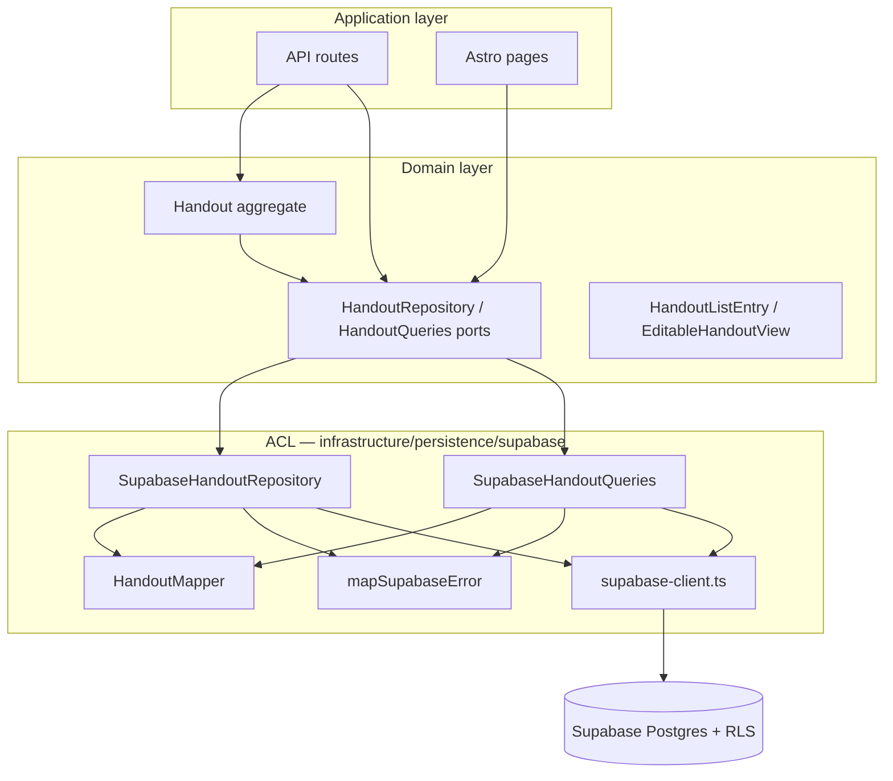

# Anti-Corruption Layer — Supabase Persistence

> **Scope:** Refactor plan only. No production code changes in this artifact.
> **Prior art:** Domain distillation (`01`) and invariant aggregate plan (`02`).

---

## Step 0 — Project Context

### Base documents

| Document | Relevant declaration |
| -------- | -------------------- |
| `context/foundation/tech-stack.md:24` | Astro + Supabase + Cloudflare chosen as battle-tested starter with auth + database out of the box |
| `context/domain/01-domain-distillation.md:76` | Supabase SSR client classified as **Generic** — "Infrastructure; **interchangeable with other BaaS/edge stacks**" |
| `context/domain/02-invariant-aggregate-refactor.md:298-319` | Proposed `HandoutRepository` port — persistence behind aggregate, not in API routes |
| `context/changes/refactor-opportunities/research.md:58-67` | TD-2: no generated Supabase types; 9 stringly-typed `.from('handouts')` call sites; duplicated row interfaces |
| `context/foundation/prd.md:56` | Markdown must be safe (XSS) — rendering is a separate boundary from persistence |

### Stack and external dependencies (from `package.json`)

| Package | Role | Boundary risk |
| ------- | ---- | ------------- |
| `@supabase/ssr` | Cookie-based SSR client factory | Leaks into pages, API, lib, middleware |
| `@supabase/supabase-js` | Raw client (tests, e2e helpers) | Parallel SDK path outside factory |
| `zod` | HTTP input validation | Appropriate at API edge; duplicated schema (TD-1) |
| `unified` + `remark-*` + `rehype-*` | Markdown → HTML pipeline | **Client bundle leak** via `HandoutEditor.tsx` |
| `@sentry/cloudflare` / `@sentry/astro` | Observability | Two SDK entry points; not persistence |

### Code layers

```
src/pages/api/handouts/*     ← commands (know Supabase query builder today)
src/pages/dashboard.astro    ← GM read model (direct .from('handouts'))
src/pages/share/[token].astro← player read model (direct query + renderer)
src/lib/load-handout-for-edit.ts ← edit preload (direct query + manual map)
src/lib/supabase.ts          ← @supabase/ssr factory (only direct SSR import)
src/middleware.ts            ← auth session via same factory
src/types.ts                 ← snake_case Handout DTO mirrors DB columns
```

There is no `src/lib/infrastructure/` or ACL directory today. Persistence shape (snake_case columns, PostgREST filters, `PGRST116`) is replicated at every call site.

---

## Step 1 — Leaky Dependencies Identified

### LD-1: Supabase PostgREST query builder (`.from('handouts')`)

**Signal:** Same SDK query pattern in API, Astro pages, and lib; hand-written row types per file; PostgREST error codes in route handlers.

| File | Line(s) | What it knows |
| ---- | ------- | ------------- |
| `src/lib/supabase.ts` | 1, 9 | `@supabase/ssr` — `createServerClient` |
| `src/middleware.ts` | 3, 11 | `createClient` → `auth.getUser()` |
| `src/pages/dashboard.astro` | 5, 20-23 | `createClient`, `.from('handouts').select(...)` |
| `src/pages/share/[token].astro` | 5, 28-33 | `createClient`, share query, `PGRST116` — `36-37` |
| `src/lib/load-handout-for-edit.ts` | 2, 38-44 | `createClient`, `.from('handouts')`, snake_case `HandoutEditRow` — `5-13` |
| `src/pages/api/handouts/index.ts` | 4, 52-60 | `createClient`, INSERT with `gm_id`, `markdown_content`, … |
| `src/pages/api/handouts/[id].ts` | 4, 62-74, 112-118 | `createClient`, UPDATE/DELETE, `PGRST116` — `77`, `121` |
| `src/pages/api/handouts/[id]/publish.ts` | 4, 47-53, 82-93 | `createClient`, SELECT/UPDATE, local `HandoutPublishRow` — `8-12`, `PGRST116` — `56`, `96` |
| `src/pages/api/handouts/[id]/archive.ts` | 4, 36-46 | `createClient`, UPDATE, `PGRST116` — `48` |
| `src/pages/api/auth/signin.ts` | 3 | `createClient` (auth — same factory) |
| `src/pages/api/auth/signup.ts` | 3 | `createClient` |
| `src/pages/api/auth/signout.ts` | 2 | `createClient` |

**9 handout query sites** + **4 auth sites** share one untyped client (`supabase.ts:9` — no `Database` generic).

**Duplicated persistence row shapes:**

| Interface | File:line | Columns hand-listed |
| --------- | --------- | ------------------- |
| `Handout` (DTO) | `src/types.ts:5-17` | Full 11-column mirror |
| `HandoutPublishRow` | `publish.ts:8-12` | 3 columns |
| `HandoutRow` / `HandoutQueryResult` | `index.ts:15-21`, `[id].ts:15-21` | id only (+ error shape) |
| `HandoutEditRow` | `load-handout-for-edit.ts:5-13` | 7 columns |
| `SharedHandoutRow` | `share/[token].astro:12-16` | 3 columns |
| `HandoutListItem` | `handout-list.ts:3-6` | Pick from `Handout` |

**CamelCase ↔ snake_case mapping duplicated:**

- `index.ts:54-59` — `markdownContent → markdown_content`
- `[id].ts:64-69` — same mapping
- `load-handout-for-edit.ts:15-24` — reverse map to `InitialHandout`

---

### LD-2: `@supabase/supabase-js` parallel client path (tests / e2e)

| File | Line |
| ---- | ---- |
| `__tests__/integration/helpers/admin-client.ts` | 1 |
| `__tests__/integration/helpers/test-users.ts` | 2 |
| `__tests__/integration/handouts/archive-handout.integration.test.ts` | 1 |
| `__tests__/integration/handouts/edit-handout.integration.test.ts` | 1 |
| `__tests__/integration/handouts/delete-archived-handout.integration.test.ts` | 1 |
| `__tests__/integration/handouts/handout-ownership.integration.test.ts` | 1 |
| `__tests__/integration/share/share-token-read.integration.test.ts` | 1 |
| `__tests__/integration/migration/rls-policy-matrix.integration.test.ts` | 7 |
| `__tests__/integration/middleware/auth-gate.integration.test.ts` | 1 |
| `e2e/auth.setup.ts` | 1 |

Integration tests bypass the app factory and assert RLS/query contracts directly — correct for DB tests, but duplicates the query shape from production pages.

---

### LD-3: `unified` markdown pipeline in client bundle

| File | Line | Leak |
| ---- | ---- | ---- |
| `src/lib/handout-renderer.ts` | 1-7, 9-17 | Imports `unified`, `remark-*`, `rehype-*` |
| `src/components/organisms/HandoutEditor.tsx` | 5, 85 | Client React island imports `renderHandoutHtml` |
| `src/pages/share/[token].astro` | 6, 52 | Server-only (OK) |

Server-side sanitization pipeline runs in the browser for live preview — couples UI to remark/rehype versions and increases client bundle size.

---

### LD-4: `zod` at HTTP + page boundary (lower severity)

| File | Line |
| ---- | ---- |
| `src/pages/api/handouts/index.ts` | 3, 8-13 |
| `src/pages/api/handouts/[id].ts` | 3, 8-13 |
| `src/pages/api/handouts/[id]/publish.ts` | 3, 42 |
| `src/pages/api/handouts/[id]/archive.ts` | 3, 31 |
| `src/pages/handouts/[id]/edit.astro` | 4, 12 |

Duplicated `handoutInputSchema` (TD-1). Zod belongs at the HTTP wire boundary; leak severity is lower than Supabase because it validates DTOs, not persistence semantics.

---

### LD-5: `@sentry/*` dual SDK

| File | Line |
| ---- | ---- |
| `src/components/organisms/HandoutEditor.tsx` | 2 (`@sentry/astro`) |
| 8 server files | `@sentry/cloudflare` |

Observability cross-cut; not a persistence swappability blocker.

---

## Step 2 — Classification and #1 Selection

| ID | Layers / files | Swap cost today | Declared swappable? | Score |
| -- | -------------- | --------------- | ------------------- | ----- |
| **LD-1 Supabase PostgREST** | **6 layers, 12 prod files, 9 query sites, 6 row types** | **High** — column rename silent at compile time | **Yes** — `01-domain-distillation.md:76` | **Worst** |
| LD-2 supabase-js in tests | Tests only | Medium | N/A (test harness) | Supporting |
| LD-3 unified in client | 2 prod files | Medium | Implicit (sanitize NFR) | Second |
| LD-4 zod duplication | 5 files | Low | N/A (wire validation OK) | Low |
| LD-5 sentry dual SDK | 9 files | Low | No | Low |

### Selected: **LD-1 — Supabase persistence model leaking through application layers**

**Justification:**

1. **Widest spread** — Every handout command and read model constructs PostgREST queries independently. Swapping Supabase for another store touches 9+ production files plus types.
2. **Intent vs code gap** — Domain distillation explicitly marks Supabase as interchangeable generic infrastructure, yet the application speaks PostgREST dialect (`gm_id`, `markdown_content`, `.neq('status','archived')`, `PGRST116`) in routes and pages.
3. **Blocks aggregate refactor** — Doc `02` proposes `HandoutRepository`, but without ACL the repository adapter would still leak if API/pages keep direct `.from()` calls.
4. **Active defects from leak** — PostgREST `PGRST116` handled inconsistently (`[id].ts:76-83` → 500 vs `121-124` → 404); error semantics belong in adapter, not routes.

LD-3 (markdown in client) is the runner-up for a **separate ACL** (`MarkdownRenderer` port) in a later phase.

---

## Step 3 — Diagnosis

### Duplication evidence

**Same INSERT shape in two places conceptually, one implementation:**

```54:59:src/pages/api/handouts/index.ts
    .insert({
      gm_id: user.id,
      title,
      markdown_content: markdownContent,
      background_category: backgroundCategory,
      tags,
```

**Parallel UPDATE mapping in `[id].ts`:**

```64:69:src/pages/api/handouts/[id].ts
    .update({
      title,
      markdown_content: markdownContent,
      background_category: backgroundCategory,
      tags,
    })
```

**Third reconstruction of edit row — `load-handout-for-edit.ts`:**

```5:24:src/lib/load-handout-for-edit.ts
interface HandoutEditRow {
  id: string;
  title: string;
  markdown_content: string;
  background_category: BackgroundCategory;
  tags: string[];
  status: HandoutStatus;
  share_token: string | null;
}

function mapHandoutEditRow(row: HandoutEditRow): InitialHandout {
  return {
    id: row.id,
    title: row.title,
    markdownContent: row.markdown_content,
    backgroundCategory: row.background_category,
    tags: row.tags,
    status: row.status,
    shareToken: row.share_token,
  };
}
```

**Dashboard read model knows DB columns:**

```20:23:src/pages/dashboard.astro
  const { data, error } = await supabase
    .from('handouts')
    .select('id, title, tags, status, background_category, share_token, created_at')
    .order('created_at', { ascending: false });
```

**Share page duplicates player-read filter (also in RLS):**

```28:33:src/pages/share/[token].astro
  const { data, error } = await supabase
    .from('handouts')
    .select('title, markdown_content, background_category')
    .eq('share_token', token)
    .in('status', ['published', 'archived'])
    .single();
```

### Boundary violations

| Violation | Evidence | Risk |
| --------- | -------- | ---- |
| Persistence in Astro pages | `dashboard.astro:20-23`, `share/[token].astro:28-33` | Pages coupled to PostgREST; untestable without Supabase mock |
| PostgREST codes in API | `PGRST116` in `publish.ts:56`, `[id].ts:77`, `archive.ts:48` | Vendor error codes in HTTP layer |
| Snake_case in UI types | `HandoutListItem` uses `background_category`, `share_token` — `handout-list.ts:5` | DB dialect in presentation |
| Untyped client | `supabase.ts:9` — no `Database` generic | Column typos compile |
| Auth + data same entry point | All routes call `createClient` then mix `auth.getUser()` with `.from('handouts')` | Cannot mock handout persistence without auth client |

### Declared swappability not met

> "Supabase SSR client, Astro routing, Cloudflare deploy — **Generic** — Infrastructure; **interchangeable with other BaaS/edge stacks**"
> — `context/domain/01-domain-distillation.md:76`

Code requires Supabase/PostgREST at every handout touchpoint. Replacing with Drizzle + Postgres, PlanetScale, or D1 would require rewriting 9 query sites, 6 interfaces, and all `PGRST116` branches — not swapping one adapter file.

---

## Step 4 — ACL Design

### Principle

**Domain and application layers know ports and domain types only.** Supabase column names, query builder, and PostgREST error codes live exclusively in `src/lib/infrastructure/persistence/supabase/`.

Aligns with aggregate plan (`02`): `HandoutRepository` is the port; Supabase is the adapter.

### Domain types (no Supabase imports)

```typescript
// src/lib/domain/handout-id.ts
type HandoutId = string & { readonly __brand: 'HandoutId' };

// src/lib/domain/share-token.ts
type ShareToken = string & { readonly __brand: 'ShareToken' };

// src/lib/domain/handout-content.ts — value object
interface HandoutContent {
  title: string;
  markdownContent: string;
  backgroundCategory: BackgroundCategory;
  tags: readonly string[];
}

// src/lib/domain/handout-read-models.ts — query results for UI (camelCase)
interface HandoutListEntry {
  id: HandoutId;
  title: string;
  tags: readonly string[];
  status: HandoutStatus;
  backgroundCategory: BackgroundCategory;
  shareToken: ShareToken | null;
  createdAt: Date;
}

interface SharedHandoutView {
  title: string;
  markdownContent: string;
  backgroundCategory: BackgroundCategory;
}

interface EditableHandoutView {
  id: HandoutId;
  title: string;
  markdownContent: string;
  backgroundCategory: BackgroundCategory;
  tags: readonly string[];
  status: HandoutStatus;
  shareToken: ShareToken | null;
}
```

### Port (narrow interface — application depends on this only)

```typescript
// src/lib/domain/ports/handout-repository.ts

interface HandoutRepository {
  /** Load aggregate for commands (publish, archive, update, delete). */
  findByIdForGm(id: HandoutId, gmId: GmId): Promise<Handout | null>;

  save(handout: Handout): Promise<void>;
  delete(handout: Handout): Promise<void>;
}

// src/lib/domain/ports/handout-queries.ts — read side (CQRS-lite)

interface HandoutQueries {
  listForGm(gmId: GmId): Promise<HandoutListEntry[]>;
  findForEdit(id: HandoutId, gmId: GmId): Promise<EditableHandoutView | null>;
  findForShare(token: ShareToken): Promise<SharedHandoutView | null>;
}

// src/lib/domain/ports/persistence-error.ts — domain-facing, not PostgREST

class HandoutNotFoundError extends Error {
  code = 'HANDOUT_NOT_FOUND';
}
class HandoutPersistenceError extends Error {
  code = 'HANDOUT_PERSISTENCE_ERROR';
}
```

### Adapter (only place that imports `@supabase/ssr` for handouts)

```typescript
// src/lib/infrastructure/persistence/supabase/supabase-handout-repository.ts

import type { SupabaseClient } from '@supabase/supabase-js'; // type-only from generated Database

class SupabaseHandoutRepository implements HandoutRepository {
  constructor(private readonly client: SupabaseClient) {}

  async findByIdForGm(id: HandoutId, gmId: GmId): Promise<Handout | null> {
    const { data, error } = await this.client
      .from('handouts')
      .select(HANDOUT_AGGREGATE_COLUMNS)
      .eq('id', id)
      .eq('gm_id', gmId)
      .maybeSingle();

    if (error) throw mapSupabaseError(error); // PGRST116 → HandoutNotFoundError HERE
    if (!data) return null;
    return HandoutMapper.toDomain(data);
  }

  async save(handout: Handout): Promise<void> {
    const row = HandoutMapper.toRow(handout);
    const { error } = await this.client.from('handouts').upsert(row).eq('id', handout.id);
    if (error) throw mapSupabaseError(error);
  }
}

// src/lib/infrastructure/persistence/supabase/supabase-handout-queries.ts
class SupabaseHandoutQueries implements HandoutQueries {
  async findForShare(token: ShareToken): Promise<SharedHandoutView | null> {
    const { data, error } = await this.client
      .from('handouts')
      .select('title, markdown_content, background_category')
      .eq('share_token', token)
      .in('status', ['published', 'archived'])
      .maybeSingle();

    if (error) throw mapSupabaseError(error);
    return data ? ShareViewMapper.toDomain(data) : null;
  }
  // listForGm, findForEdit — same pattern
}
```

### Mapper (single snake_case ↔ domain conversion)

```typescript
// src/lib/infrastructure/persistence/supabase/handout-mapper.ts

/** ONLY file that references markdown_content, background_category, gm_id, etc. */

function toRow(handout: Handout): HandoutRow {
  return {
    id: handout.id,
    gm_id: handout.gmId,
    title: handout.content.title,
    markdown_content: handout.content.markdownContent,
    background_category: handout.content.backgroundCategory,
    tags: [...handout.content.tags],
    status: handout.status,
    share_token: handout.shareToken,
    published_at: handout.publishedAt?.toISOString() ?? null,
    archived_at: handout.archivedAt?.toISOString() ?? null,
  };
}

function toDomain(row: HandoutRow): Handout {
  return Handout.reconstitute({ /* camelCase domain props */ });
}
```

**Generated types decision (encode in ACL, not API):**

Run `supabase gen types typescript` → `src/lib/infrastructure/persistence/supabase/database.types.ts`. `HandoutRow = Database['public']['Tables']['handouts']['Row']`. Column renames break the mapper at compile time, not at 9 call sites.

### PostgREST error translation (adapter only)

```typescript
// src/lib/infrastructure/persistence/supabase/map-supabase-error.ts

function mapSupabaseError(error: PostgrestError): never {
  if (error.code === 'PGRST116') {
    throw new HandoutNotFoundError();
  }
  throw new HandoutPersistenceError(error.message);
}
```

HTTP routes map `HandoutNotFoundError` → 404, domain errors from aggregate → 409/422 — never inspect `PGRST116`.

### Factory / composition root

```typescript
// src/lib/infrastructure/persistence/create-handout-persistence.ts

function createHandoutPersistence(requestHeaders: Headers, cookies: AstroCookies) {
  const client = createSupabaseClient(requestHeaders, cookies); // moves from supabase.ts
  if (!client) return null;
  return {
    repository: new SupabaseHandoutRepository(client),
    queries: new SupabaseHandoutQueries(client),
  };
}
```

Auth routes and middleware keep using a slim `createAuthClient()` until a separate `AuthPort` is justified — **out of scope for handout ACL phase 1**.

### Thin API route (after ACL)

```typescript
// publish.ts — pseudocode
const persistence = createHandoutPersistence(context.request.headers, context.cookies);
if (!persistence) return configuredError();

const gmId = await requireGmId(context);
const handout = await persistence.repository.findByIdForGm(id, gmId);
if (!handout) return notFound();

try {
  const shareToken = handout.publish();
  await persistence.repository.save(handout);
  return json({ shareToken: shareToken as string });
} catch (e) {
  return mapDomainError(e);
}
```

No `createClient`, no `.from('handouts')`, no `HandoutPublishRow`, no `PGRST116`.

---

## Step 5 — Isolation Proof and Before/After

### Swapping Supabase touches only

| File (new) | Role |
| ---------- | ---- |
| `src/lib/infrastructure/persistence/supabase/supabase-handout-repository.ts` | Write adapter |
| `src/lib/infrastructure/persistence/supabase/supabase-handout-queries.ts` | Read adapter |
| `src/lib/infrastructure/persistence/supabase/handout-mapper.ts` | Row ↔ domain |
| `src/lib/infrastructure/persistence/supabase/map-supabase-error.ts` | Error translation |
| `src/lib/infrastructure/persistence/supabase/database.types.ts` | Generated (optional phase) |
| `src/lib/infrastructure/persistence/supabase/supabase-client.ts` | `createServerClient` wrapper |
| `src/lib/infrastructure/persistence/create-handout-persistence.ts` | Composition root |

**Does NOT touch:** `HandoutEditor.tsx`, `HandoutCard.astro`, domain aggregate tests, HTTP route paths, RLS migrations (RLS stays as DB defence-in-depth).

To swap to another backend: implement `HandoutRepository` + `HandoutQueries` in a new adapter folder; update composition root only.

### Before / after by current leak site

| File | Before | After |
| ---- | ------ | ----- |
| `index.ts` | Direct INSERT + snake_case | `Handout.create()` → `repository.save()` |
| `[id].ts` PUT/DELETE | Direct UPDATE/DELETE + `PGRST116` | `repository.find` → aggregate method → `save`/`delete` |
| `publish.ts` | SELECT + UPDATE + local row types | `repository.find` → `publish()` → `save` |
| `archive.ts` | Direct UPDATE | `repository.find` → `archive()` → `save` |
| `load-handout-for-edit.ts` | Direct query + `mapHandoutEditRow` | `queries.findForEdit()` returns `EditableHandoutView` |
| `dashboard.astro` | Direct `.from('handouts').select(...)` | `queries.listForGm(user.id)` |
| `share/[token].astro` | Direct query + local `SharedHandoutRow` | `queries.findForShare(token)` |
| `handout-list.ts` | Picks snake_case from `Handout` | Operates on `HandoutListEntry` (camelCase) |
| `types.ts` | `Handout` snake_case DTO | Deprecate for app use; row type lives in mapper only |
| `HandoutEditor.tsx` | Receives `InitialHandout` (camelCase) | Unchanged wire shape; fed by `EditableHandoutView` adapter at page boundary |

### UI receives domain read models, not Supabase rows

**Before:** `dashboard.astro` passes rows with `background_category`, `share_token` to `HandoutCard.astro:14-15`.

**After:** `HandoutQueries.listForGm()` returns `HandoutListEntry[]` with `backgroundCategory`, `shareToken`. Astro page maps to component props — components never see snake_case.

---

## Step 6 — Verification Criteria and Phased Plan

### Success criterion (grep audit)

After refactor, these patterns must match **only** files under `src/lib/infrastructure/persistence/supabase/` (plus generated types):

```bash
rg "\.from\('handouts'\)" src/
rg "PGRST116" src/
rg "markdown_content|background_category|share_token" src/ --glob '!**/infrastructure/**'
rg "from '@supabase/ssr'" src/
```

| Pattern | Knows today | Knows after |
| ------- | ----------- | ----------- |
| `.from('handouts')` | 9 files in `src/pages/`, `src/lib/load-handout-for-edit.ts` | **0** outside `infrastructure/persistence/supabase/` |
| `PGRST116` | `publish.ts`, `[id].ts`, `archive.ts`, `share/[token].astro` | **0** outside `map-supabase-error.ts` |
| snake_case column names in app/UI | 7+ files | **0** outside mapper + generated types |
| `@supabase/ssr` import | `supabase.ts` only (good) | `supabase-client.ts` in infrastructure (+ auth/middleware until AuthPort) |
| `@/lib/supabase` in handout code | 8 handout-related files | **0** — use `createHandoutPersistence()` |

Integration tests that assert RLS directly (`share-token-read.integration.test.ts`) **may keep** `@supabase/supabase-js` — they test the database contract, not the app ACL. Optionally add adapter integration tests that mock the client.

### Phased plan (aligned with project conventions)

| Phase | Goal | Test-first | Deliverables |
| ----- | ---- | ---------- | ------------ |
| **ACL-1 — Ports + mapper unit tests** | Define `HandoutRepository`, `HandoutQueries`, `HandoutMapper`, error types | **Yes** — `__tests__/lib/infrastructure/handout-mapper.test.ts` | Ports in `src/lib/domain/ports/`; mapper with round-trip tests |
| **ACL-2 — Supabase adapter** | Implement repository + queries; `mapSupabaseError` | **Yes** — adapter tests with mocked Supabase client | `infrastructure/persistence/supabase/*` |
| **ACL-3 — Wire API routes** | Replace direct queries in 4 handout API files | Update `__tests__/integration/handouts/*` | Thin routes; no `PGRST116` in API |
| **ACL-4 — Wire read models** | `dashboard.astro`, `share/[token].astro`, `load-handout-for-edit.ts` | Extend dashboard/share integration coverage | Pages call `HandoutQueries` only |
| **ACL-5 — Generated types** | `supabase gen types` + typed client | CI script check | `database.types.ts`; remove local row interfaces |
| **ACL-6 — Cleanup** | Deprecate snake_case `Handout` in `types.ts`; camelCase read models in UI | Lint rule or dep-cruiser forbidden import | `HandoutListEntry` replaces `HandoutListItem` snake picks |

**Parallel track (optional, LD-3):** `MarkdownRenderer` port — server adapter in `infrastructure/rendering/`; client preview via API endpoint or server-only island to remove `unified` from `HandoutEditor` bundle.

### Contract decisions encoded in ACL (not API)

| Question | Decision | Where |
| -------- | -------- | ----- |
| PostgREST "no rows" semantics | Map to `HandoutNotFoundError`, not HTTP 500 | `map-supabase-error.ts` |
| Column naming authority | Generated `Database` type + mapper | `handout-mapper.ts` |
| Player read filter (`published` \| `archived`) | Encapsulate in `findForShare` | `supabase-handout-queries.ts` |
| Edit preload excludes archived | `findForEdit` returns null (not redirect logic in query file) | `supabase-handout-queries.ts` + page |
| RLS vs app layer | RLS remains; ACL does not duplicate policy logic in comments only | Migration unchanged |

### Load-bearing names to register

| Symbol | Location |
| ------ | -------- |
| `HandoutRepository` | `src/lib/domain/ports/handout-repository.ts` |
| `HandoutQueries` | `src/lib/domain/ports/handout-queries.ts` |
| `HandoutMapper` | `src/lib/infrastructure/persistence/supabase/handout-mapper.ts` |
| `SupabaseHandoutRepository` | adapter |
| `SupabaseHandoutQueries` | adapter |
| `mapSupabaseError` | adapter |
| `HandoutListEntry`, `EditableHandoutView`, `SharedHandoutView` | `src/lib/domain/handout-read-models.ts` |
| `createHandoutPersistence` | composition root |

Rename `Handout` interface in `types.ts` → `HandoutRow` or remove from public exports once ACL lands (per `02-invariant-aggregate-refactor.md:437`).

### Relationship to invariant aggregate refactor (`02`)

| Doc 02 phase | ACL dependency |
| ------------ | -------------- |
| Phase 1 — Domain core | Independent (pure unit tests) |
| Phase 2 — Repository | **Same as ACL-1 + ACL-2** — implement port via Supabase adapter |
| Phase 3 — API adoption | **Same as ACL-3** |
| Phases 4–6 | Domain policy; ACL unchanged |

Recommend executing **ACL-1/2 before or with** doc 02 Phase 2 — the repository port IS the anti-corruption boundary.

---

## Secondary leak note — LD-3 (markdown pipeline)

`HandoutEditor.tsx:5` imports `renderHandoutHtml` which pulls the full `unified` stack into the client bundle. The PRD guardrail (`prd.md:56`) requires sanitization at render time; running the same pipeline client-side duplicates the security boundary.

**Deferred ACL sketch:**

```typescript
interface MarkdownRenderer {
  renderSafeHtml(markdown: string): SafeHtml;
}
// Server: UnifiedMarkdownRenderer
// Client preview: POST /api/handouts/preview { markdown } → { html } OR server-only preview island
```

Not #1 because it affects 2 production files vs 12 for Supabase, and swapping markdown libraries is lower operational risk than swapping persistence.

---

## Architecture diagram (target)


