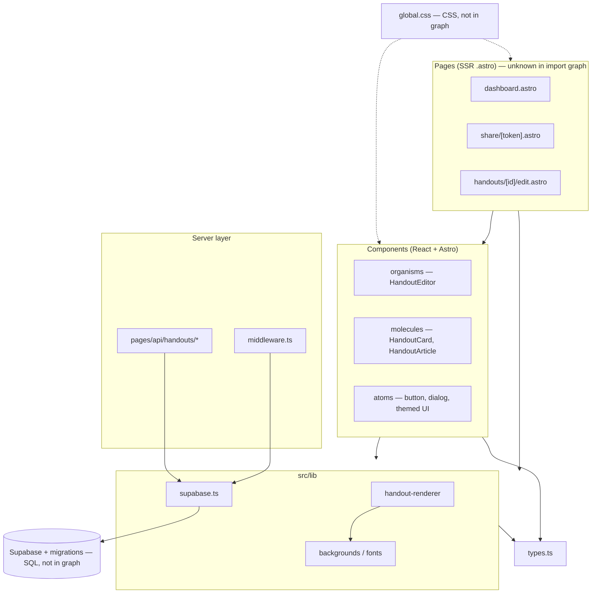

# Repo map

**Status:** complete  
**Synthesized from:** `artifact-1-territory.md`, `artifact-2-structure.md`, `artifact-3-contributors.md`  
**Prompt:** `.cursor/prompts/m4l2-repo-map-synthesis.md`  
**Generated:** 2026-06-21

Onboarding map for the **TTRPG Handouts Generator** — an Astro 6 SSR app (React islands, Supabase auth, Cloudflare Workers) for creating and sharing themed markdown handouts.

---

## 1. TL;DR

This repo is a **young, solo-maintained** full-stack app (~1 month of git history, ~195 commits). Runtime work concentrates on the **handout vertical slice**: editor UI, themed rendering, API routes, and Supabase-backed sharing — not on `context/` planning docs, even though foundation markdown ranks #1 by commit count.

The import graph (TS/TSX) is **acyclic and layered** — no circular dependencies — but **git co-change is much noisier** than imports suggest: atoms, molecules, organisms, pages, and `global.css` ship together. The structural hub is **`HandoutEditor.tsx`** (highest fan-out); the auth/data hub is **`supabase.ts`** (highest fan-in among services).

Pain points: **HandoutEditor** (UI + fetch + preview + Sentry), **markdown sanitize boundary**, **RLS/access rules** (only visible in integration tests + SQL), and **Astro `.astro` orchestration** (invisible to dependency-cruiser). There is **one human owner** for every zone; fallback is written docs.

---

## 2. Territory — core vs periphery

### Core (where hands-on product work lives)

| Zone | Depth | Why it matters |
| ---- | ----- | -------------- |
| `src/components/organisms/` | **Deep** — HandoutEditor pulls 10+ internal deps | #2 folder by git activity; editor + share UX |
| `src/pages/api/` | **Medium** — thin routes over Supabase | Handout CRUD, publish, archive, auth |
| `src/lib/` | **Deep** — renderer pipeline, theme config, SSR client | Markdown safety + category theming |
| `src/styles/global.css` | **Cross-cutting** | Every UI-facing change touches it (git) |
| `src/middleware.ts` | **Shallow file, wide blast radius** | Gates all protected routes |

### Periphery (busy in git but not runtime)

| Zone | Note |
| ---- | ---- |
| `context/foundation/` | **#1 by commits** — roadmap, test-plan, lessons; process docs, not deploy code |
| `context/archive/*` | Historical change plans; git still references old `context/changes/<id>/` paths |
| `context/changes/s-03/` | Only **active** change at scan time (edit-handout flow) |
| `e2e/`, `playwright-report/` | Quality gate; excluded from structure scan |

### Folder structure vs real activity

- **Looks like planning repo, behaves like UI repo** — `context/foundation` beats `src/` in commit count, but newcomers ship features in `src/components` + `src/pages/api`.
- **Atomic design folders co-change as one subsystem** — git treats atoms/molecules/organisms as a unit; imports are cleaner (top-down DAG).
- **Two HandoutArticle implementations** — `.tsx` (editor preview) and `.astro` (share page); same concept, different stacks (**unknown** coupling between them in tooling).

### Activity over time

| Period | Focus |
| ------ | ----- |
| **2026-05** | Bootstrap → MVP: schema, auth, first handout API |
| **2026-06** | Polish + quality: HandoutEditor, theming (fonts/backgrounds), integration/RLS tests, **s-03** edit flow |

_No earlier quarters exist — repo started 2026-05-22._

---

## 3. Real couplings

Tag legend: **git** = co-change in commits · **import** = dependency-cruiser · **manual** = human-edited cross-cutting · **unknown** = stack not in graph · **process** = docs/planning, not runtime

### What moves together

| Coupling | Source | Cost of change |
| -------- | ------ | -------------- |
| molecules ↔ organisms (handout UI) | **git** (10 co-commits) | Any editor/card change spans atomic layers — multi-file edits expected |
| organisms ↔ pages (dashboard, share, edit) | **git** (7 co-commits) | Page + island ship together; **import** shows no component→page leaks in TS |
| atoms + molecules + organisms (full tree) | **git** (5 triple co-commits) | Theme refactors (fonts, backgrounds, restyle) hit entire UI subtree |
| API ↔ middleware | **git** (5 co-commits) | Access-control work touches both; **import**: both → `supabase.ts` |
| HandoutEditor ↔ global.css | **git** + **manual** | Editor and theme CSS edited together; CSS **unknown** to import graph |
| HandoutEditor → ShareDialog | **import** (organism→organism) | Soft convention break; editor coupled to share modal |
| roadmap.md ↔ everything | **process** | Planning commits bundle docs + code — **not** runtime coupling |
| Page → HandoutList → HandoutCard → React buttons | **unknown** | `.astro` import chain; real SSR stack, invisible to depcruise |

### Layers and cycles

| Check | Result | Source |
| ----- | ------ | ------ |
| Circular imports in hot areas | **None** | **import** (61 TS/TSX modules) |
| `types.ts` as foundation | **Pass** — leaf node | **import** |
| `lib` ↛ components/pages | **Pass** | **import** |
| `api` ↛ components | **Pass** | **import** |
| `.astro` page orchestration | **Not analyzed** | **unknown** |

### Hubs (high fan-in / fan-out)

- **Fan-out:** `HandoutEditor.tsx` — **import** + **git** (#2 file)
- **Fan-in:** `utils.ts` (11), `supabase.ts` (9), `button.tsx` (7) — **import**
- **Manual hub:** `global.css` — **git** (#3 file), **unknown** in graph

---

## 4. Risk zones

| Zone | Why it's risky |
| ---- | -------------- |
| **HandoutEditor** | Structural hub + client fetch to API + live markdown preview + Sentry — mock-heavy to unit test, e2e-natural |
| **Markdown sanitize pipeline** (`handout-renderer.ts`) | XSS boundary via rehype-sanitize; isolated in graph but security-critical |
| **Supabase session + middleware** | Single client (`supabase.ts`) backs API, middleware, and SSR pages — auth mistake hits everything |
| **RLS / migrations** | Access rules live in SQL + integration tests — **unknown** to JS import graph |
| **global.css + themed assets** | Cross-cutting visual coupling; no import graph coverage |
| **archive-handout-card-dom.ts** | React actions mutate Astro-rendered DOM — brittle bridge, needs integration coverage |

---

## 5. Who to ask

Solo maintainer — one contact for all zones; docs as fallback.

| Zone | Contact | Fallback |
| ---- | ------- | -------- |
| Handout UI / editor / theming | **Mikołaj Grygorcewicz** (`pterodactor3000`) | `context/archive/2026-06-09-ui-restyle/`, `…-retheme-backgrounds/`, `…-per-style-fonts/` |
| API + auth + middleware | **Mikołaj Grygorcewicz** | `context/archive/2026-06-04-testing-access-control-critical-path/` |
| Markdown / XSS | **Mikołaj Grygorcewicz** | `context/archive/2026-06-06-testing-markdown-rendering-safety/` |
| RLS / integration tests | **Mikołaj Grygorcewicz** | `__tests__/integration/migration/rls-policy-matrix.integration.test.ts` |
| Infra / Sentry / deploy | **Mikołaj Grygorcewicz** | `context/archive/2026-06-13-sentry-introduction/`, `AGENTS.md` |
| Any zone (async) | — | `context/foundation/lessons.md`, `context/foundation/roadmap.md` |

---

## 6. First day — read these first

Ordered path from wide context → core runtime → current work:

1. **`AGENTS.md`** (repo root) — stack, conventions, atomic design rules  
2. **`src/types.ts`** — handout domain model shared everywhere  
3. **`src/middleware.ts`** — what routes are protected and how sessions work  
4. **`src/lib/supabase.ts`** — server Supabase client (API + pages + middleware)  
5. **`src/pages/api/handouts/[id].ts`** — handout CRUD API shape  
6. **`src/components/organisms/HandoutEditor.tsx`** — main product surface (editor + preview + save/publish)  
7. **`src/lib/handout-renderer.ts`** — markdown → HTML + sanitize pipeline  
8. **`context/changes/s-03/plan.md`** — in-flight edit-handout work (or nearest archived plan if s-03 is done)

_Skip `context/foundation/roadmap.md` on day one unless you need milestone context — high commit churn, low runtime signal._

---

## 7. Limitations

| Topic | What this map claims | What it does **not** claim |
| ----- | -------------------- | --------------------------- |
| **Time window** | 12-month scan requested; **actual history ≈ 1 month** (2026-05-22 → 2026-06-21) | Long-term ownership trends or legacy drift |
| **Territory method** | Git path co-change + commit counts | Line churn, code complexity, runtime traffic |
| **Structure method** | dependency-cruiser on **TS/TSX only** (61 modules) | `.astro`, CSS, SQL, Playwright e2e, env secrets |
| **Contributors** | Git author attribution | AI-assisted portions not separately attributed |
| **Coupling proof** | Tags per finding (git / import / unknown) | Complete runtime call graph |
| **Archive paths** | Git history may cite `context/changes/<id>/` | Those folders may be moved to `context/archive/` — verify on disk |

**Refresh:** re-run artifacts 1–3 after major features or when `.astro` scanning is added to dependency-cruiser.

---

## Source artifacts

| Artifact | File | Status |
| -------- | ---- | ------ |
| Territory (git) | `artifact-1-territory.md` | complete |
| Structure (depcruise) | `artifact-2-structure.md` | complete |
| Contributors (git) | `artifact-3-contributors.md` | complete |
